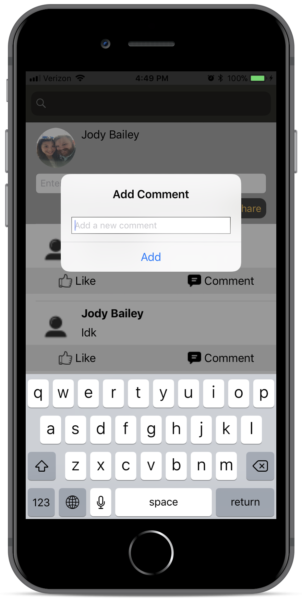

# EagleSocial
This project was engineered and developed by 4 students (Lacy Simpson, Jody Bailey, Jason Pearson, and Jeremiah Carr) for Object Oriented Programming at the Universty of Southern Mississippi. We chose to use the language Swift for the project to get hands on experience with iOS Mobile application development. We also used Google's non-relational database called Firebase.  

The application is a social media platform made specifically for students and faculty at USM. It allows fellow students and faculty members to create their own profile, login to the application, and set up a personal profile page. The logged in user can then communicate with other students and faculty members via posting to the newsfeed, commenting on other user's post in the newsfeed, liking post in the newsfeed, or by direct messaging other users. Setting's features of the application include changing the user's email and/or password and logging out of the application. The user's profile page can be customized by adding a profile picture, writing an about me section, and updating their current year, age, and name. The profile page will also display the logged in user's previous newsfeed posts. 

We were very proud of the fully functional product that we finished with. 

-To The Top Apps

<HTML>
  
  ## Screenshots
   
   
   
   
   
  
  
</HTML>
