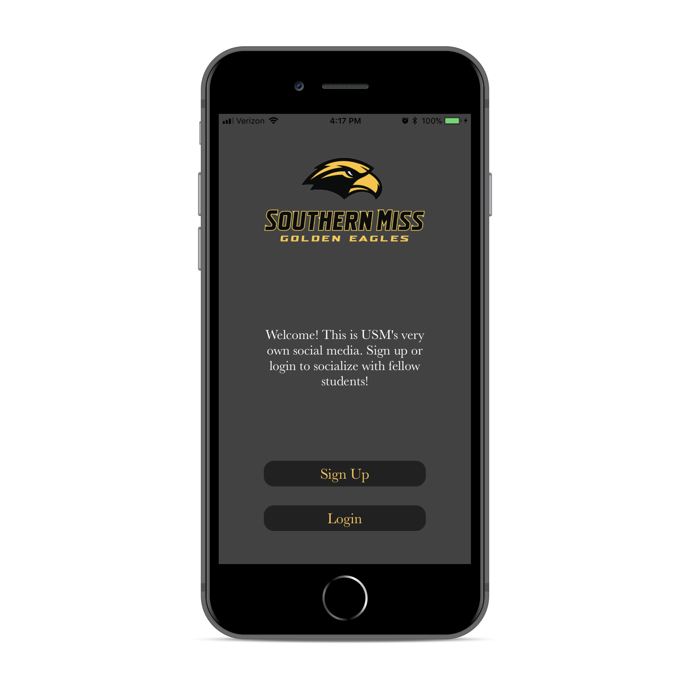

# EagleSocial
This is a school project for the Universty of Southern Mississippi. It is going to be a social media platform made specifically for students and faculty at USM. It will allow fellow students and faculty to communicate with one another. It will also be very easy to find classmates because there will eventually be a feature where the professors and students can be in a "Class" group. So if you don't remember your classmates name, no problem, look in the group created for your class and find them. There will be private messaging and a news feed area as well. We are still debating on allowing multiple photo uploads because we would like this to be a social media just for school and not a "post everything about your life" kind of social media. Follow the journey of the development to see how it goes!

## Main Screen

## Login 

## Sign-Up

## News Feed

## Adding Comment

## Post Likes

## Friends List

